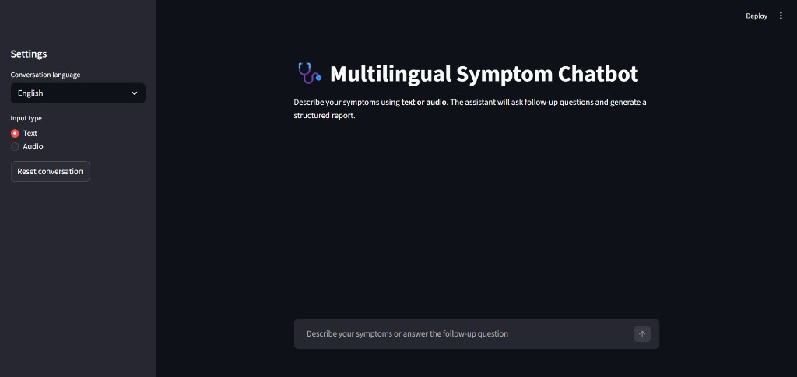
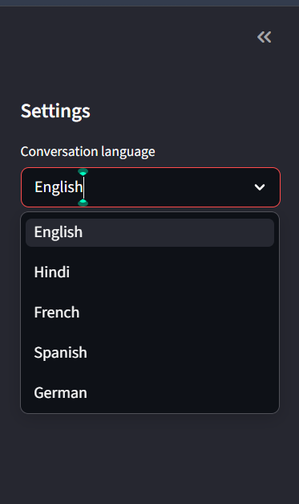
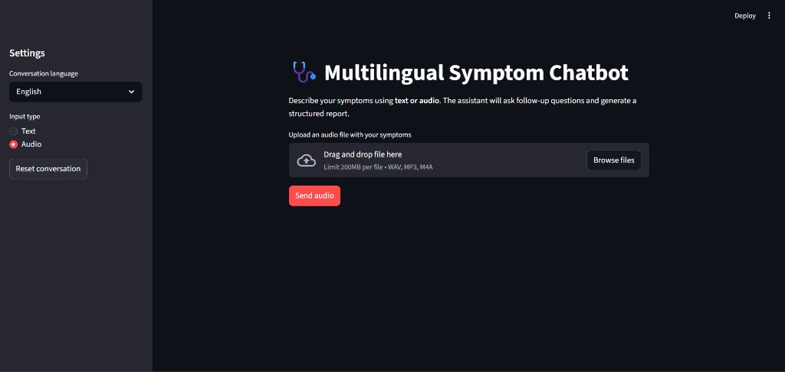
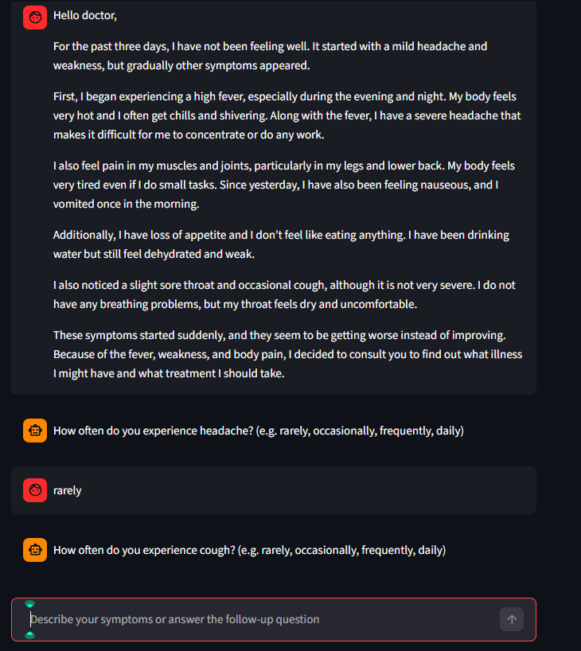
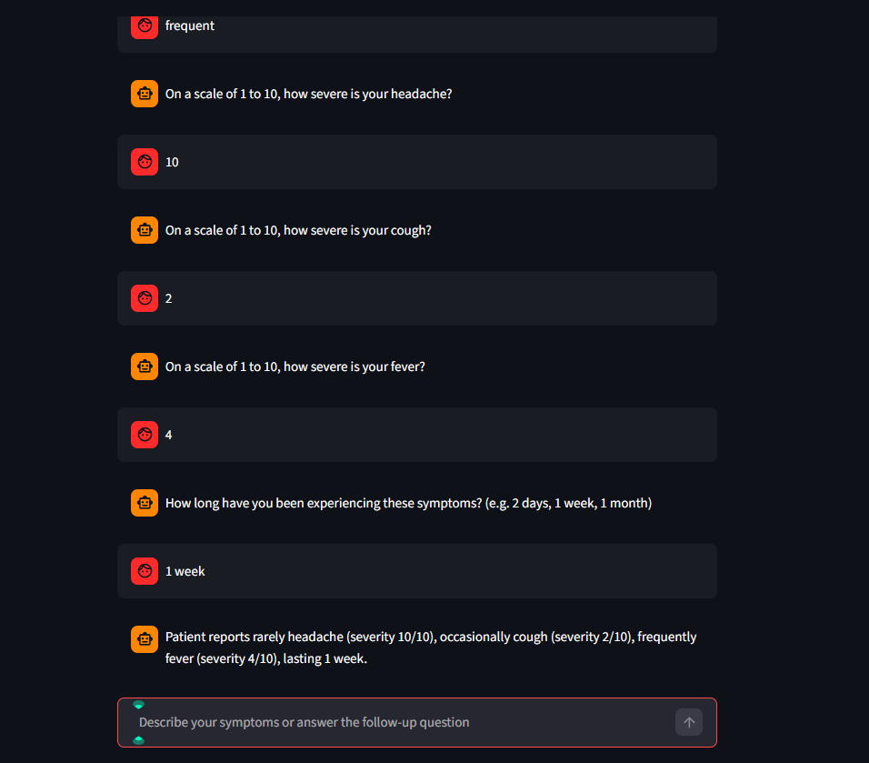
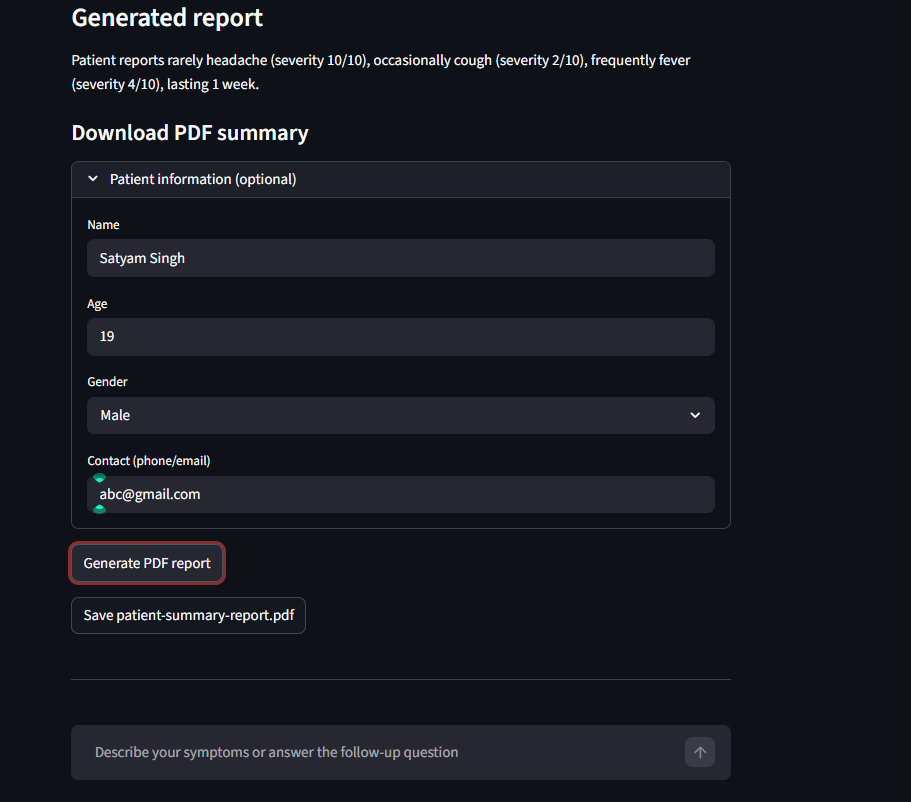
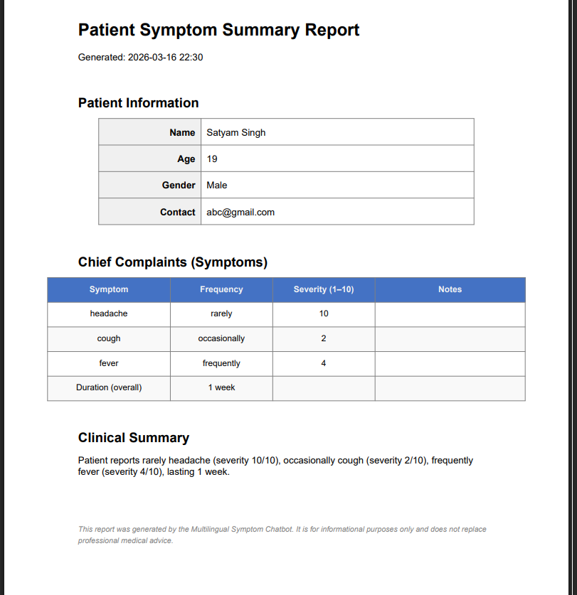
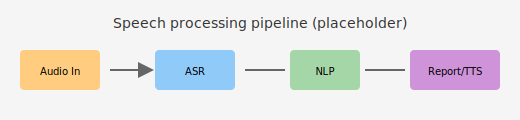
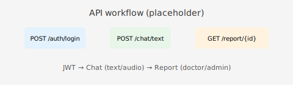

# Multilingual Symptom Chatbot

[](https://www.python.org/downloads/)
[](https://fastapi.tiangolo.com/)
[](https://streamlit.io/)
[](LICENSE)

A **production-ready** multilingual chatbot for symptom screening with **text and audio input**, follow-up dialogue, structured report generation, and **PDF export**. Built with **FastAPI**, **Streamlit**, **MongoDB**, and manual NLP (keyword-based extraction—no LLM required).

<p align="center">
  
</p>

---

## Table of contents

- [Quick start](#quick-start)
- [Project description](#project-description)
- [Features](#features)
- [Screenshots](#screenshots)
- [Architecture](#architecture)
- [System pipeline](#system-pipeline)
- [Project structure](#project-structure)
- [Tech stack](#tech-stack)
- [Installation guide](#installation-guide)
- [Running instructions](#running-instructions)
- [API endpoints](#api-endpoints)
- [Environment variables](#environment-variables)
- [Testing](#testing)
- [Contributing](#contributing)
- [Future improvements](#future-improvements)
- [License](#license)

---

## Quick start

```bash
# Clone and setup
git clone <repository-url>
cd multilingual-speech-chatbot
python -m venv venv
source venv/bin/activate   # Linux/macOS
# .\venv\Scripts\Activate.ps1  # Windows
pip install -r requirements.txt
cp .env.example .env       # Edit with your settings

# Terminal 1: Start backend
uvicorn app.main:app --host 0.0.0.0 --port 8000

# Terminal 2: Start Streamlit UI
streamlit run ui_app.py
```

Open **http://localhost:8501** in your browser.

---

## Project description

The **Multilingual Symptom Chatbot** helps users describe symptoms via text or audio. The assistant asks follow-up questions (frequency, severity, duration), extracts structured data using keyword-based NLP, and generates a natural-language report. Users can download a **PDF summary** with patient information, chief complaints, and clinical summary.

| Domain | Use case |
|--------|----------|
| **Healthcare** | Symptom screening with frequency, severity, duration; structured reports and PDF export |
| **Education** | Reusable NLP and dialogue for Q&A flows |
| **Reception** | Multilingual information desk with TTS/ASR |

**Key capabilities:**

- **Streamlit UI** — Chat-style interface with language selection (EN, HI, FR, ES, DE), text or audio input, and PDF download
- **Manual NLP** — Keyword matching from `data/symptom_list.json`; no ChatGPT or external LLM
- **PDF report** — Patient Symptom Summary Report with demographics, chief complaints table, and clinical summary
- **Translation** — Input/output via deep-translator (Google)
- **ASR** — Whisper for audio transcription
- **TTS** — Edge-TTS for spoken responses

---

## Features

- **Symptom extraction** — Keyword matching from `data/symptom_list.json` with configurable list
- **Follow-up dialogue** — Asks frequency, severity (1–10), and duration; outputs structured JSON
- **Report generation** — Template-based natural-language summary (no LLM)
- **PDF export** — Patient Symptom Summary Report (ReportLab) with optional patient info
- **Multilingual** — English, Hindi, French, Spanish, German (input → EN → process → translate back)
- **Speech-to-text** — Whisper for audio uploads
- **Text-to-speech** — Edge-TTS with locale-specific voices (MP3)
- **Streamlit UI** — Chat interface, settings sidebar, PDF download section
- **Database** — MongoDB for users, patients, reports (optional)
- **Security** — bcrypt hashing, JWT, roles: user, admin, doctor
- **REST API** — FastAPI with OpenAPI docs at `/docs`
- **CLI demo** — Standalone script for terminal-based interaction

---

## Screenshots

### Main UI

Chat interface with sidebar for language and input type (text or audio).

<p align="center">
  
</p>

### Settings

Conversation language selection (English, Hindi, French, Spanish, German).

<p align="center">
  
</p>

### Audio input

Upload audio file (WAV, MP3, M4A) with spoken symptoms.

<p align="center">
  
</p>

### Conversation flow

Interactive Q&A: symptom description → frequency → severity → duration.

<p align="center">
  
</p>

### Symptom summary

Generated report with frequency, severity, and duration for each symptom.

<p align="center">
  
</p>

### PDF download

Optional patient information form and PDF generation/download.

<p align="center">
  
</p>

### PDF report

Patient Symptom Summary Report with demographics, chief complaints, and clinical summary.

<p align="center">
  
</p>

---

## Architecture

High-level system architecture:

<p align="center">
  
</p>

| Layer | Role |
|-------|------|
| **Client** | Streamlit UI, CLI, or API clients |
| **FastAPI** | Routes: `/chat/text`, `/chat/audio`, `/auth/*`, `/report/*` |
| **Services** | ASR (Whisper), NLP, Report, PDF (ReportLab), Translation (deep-translator), TTS (Edge-TTS) |
| **Data** | MongoDB (users, patients, reports) + JWT / bcrypt |

See [docs/ARCHITECTURE.md](docs/ARCHITECTURE.md) for module separation and data flow.

---

## System pipeline

End-to-end flow for a single request:

<p align="center">
  
</p>

1. **Input** — Text or audio (upload).  
2. **ASR** (if audio) — Whisper transcribes and optionally translates to English.  
3. **Translation** (if needed) — Input translated to English for NLP.  
4. **NLP** — Symptom extraction (keyword match) or follow-up state update (frequency, severity, duration).  
5. **Report** — Structured data → natural language summary (template-based); PDF generated on request.  
6. **Translation** — Response translated to user's language.  
7. **TTS** (optional) — Edge-TTS generates MP3 (e.g. returned as base64).  
8. **Storage** (optional) — Users, patients, reports persisted in MongoDB.

---

## Project structure

```
multilingual-speech-chatbot/
├── README.md
├── requirements.txt
├── .env.example
├── .gitignore
├── ui_app.py                 # Streamlit chat UI
│
├── app/                      # Application bootstrap
│   ├── main.py               # FastAPI app, lifespan, CORS
│   ├── config.py             # Settings from env
│   └── dependencies.py       # Auth, DB, config deps
│
├── api/                      # REST routes
│   ├── routes_auth.py        # Register, login
│   ├── routes_chat.py        # /chat/text, /chat/audio
│   └── routes_report.py      # /report/pdf, /report/{patient_id}
│
├── models/                   # Pydantic models
│   ├── user_model.py
│   ├── symptom_model.py
│   └── report_model.py
│
├── services/                 # Business logic
│   ├── nlp_service.py        # Symptom extraction, follow-up
│   ├── report_service.py     # Report generation (template-based)
│   ├── pdf_service.py        # PDF generation (ReportLab)
│   ├── translation_service.py
│   ├── asr_service.py        # Whisper
│   ├── tts_service.py        # Edge-TTS
│   └── security_service.py   # bcrypt, JWT
│
├── database/                 # Persistence
│   ├── db_connection.py
│   ├── mongodb_client.py
│   └── schemas.py
│
├── utils/                    # Shared utilities
│   ├── text_processing.py
│   └── constants.py
│
├── data/
│   └── symptom_list.json
│
├── demo/
│   └── cli_chatbot.py        # CLI demo
│
├── tests/                    # Unit tests
├── docs/                     # Documentation
├── assets/
│   ├── diagrams/             # Architecture & pipeline
│   └── screenshots/          # UI screenshots
│
└── scripts/                  # Run scripts
    ├── setup_env.sh          # Linux/macOS setup
    ├── run_server.sh         # Linux/macOS run server
    ├── run_ui.ps1            # Windows run Streamlit UI
    ├── setup_env.ps1         # Windows setup
    └── run_server.ps1        # Windows run server
```

---

## Tech stack

| Category | Technology |
|----------|------------|
| **API** | FastAPI, Uvicorn |
| **UI** | Streamlit |
| **Database** | MongoDB (PyMongo) |
| **Auth** | JWT (python-jose), bcrypt |
| **NLP** | Custom keyword extraction + follow-up state machine |
| **ASR** | OpenAI Whisper |
| **TTS** | Edge-TTS |
| **Translation** | deep-translator (Google) |
| **PDF** | ReportLab |
| **Validation** | Pydantic, pydantic-settings |
| **Testing** | pytest, pytest-asyncio |

---

## Installation guide

### Prerequisites

- **Python 3.10+**
- **MongoDB** (local or remote; set `MONGODB_URI` in `.env`)
- Optional: **FFmpeg** for Whisper audio handling

### 1. Clone and enter project

```bash
git clone <repository-url>
cd multilingual-speech-chatbot
```

### 2. Create virtual environment

**Linux / macOS:**

```bash
python3 -m venv venv
source venv/bin/activate
```

**Windows (PowerShell):**

```powershell
python -m venv venv
.\venv\Scripts\Activate.ps1
```

Or use the setup script (see [Running instructions](#running-instructions)).

### 3. Install dependencies

```bash
pip install --upgrade pip
pip install -r requirements.txt
```

### 4. Environment file

Create `.env` from `.env.example`:

```bash
cp .env.example .env    # Linux/macOS
copy .env.example .env   # Windows
```

Edit `.env`: set `SECRET_KEY`, `MONGODB_URI`, and any optional API keys.

---

## Running instructions

### Option A: Streamlit UI (recommended)

Run the **backend** and **frontend** in two terminals.

**Terminal 1 — Backend (FastAPI):**

```bash
cd multilingual-speech-chatbot
source venv/bin/activate   # Use .\venv\Scripts\Activate.ps1 on Windows
uvicorn app.main:app --host 0.0.0.0 --port 8000
```

**Terminal 2 — Frontend (Streamlit):**

```bash
cd multilingual-speech-chatbot
source venv/bin/activate   # Use .\venv\Scripts\Activate.ps1 on Windows
streamlit run ui_app.py
```

Then open **http://localhost:8501** in your browser.

**Or use the script (from project root):**

```powershell
.\scripts\run_ui.ps1
```

### Option B: Scripts

**Linux / macOS:**

```bash
chmod +x scripts/setup_env.sh scripts/run_server.sh
./scripts/setup_env.sh
source venv/bin/activate
./scripts/run_server.sh
```

**Windows (PowerShell):**

```powershell
.\scripts\setup_env.ps1
.\venv\Scripts\Activate.ps1
.\scripts\run_server.ps1
```

### Option C: Manual (API only)

```bash
# From project root, with venv activated
uvicorn app.main:app --host 0.0.0.0 --port 8000
```

- API: **http://localhost:8000**
- OpenAPI docs: **http://localhost:8000/docs**

### CLI demo

```bash
python demo/cli_chatbot.py
```

---

## API endpoints

| Method | Endpoint | Description |
|--------|----------|-------------|
| `GET` | `/` | Service info |
| `POST` | `/auth/register` | Register (JSON: username, email, password, role) |
| `POST` | `/auth/login` | Login (form: username, password) → JWT |
| `POST` | `/chat/text` | Text chat (form: text, language, optional state_json) |
| `POST` | `/chat/audio` | Audio chat (multipart: audio file, language) |
| `POST` | `/report/pdf` | Generate PDF patient summary (JSON body) |
| `GET` | `/report/{patient_id}` | Latest report (doctor/admin, Bearer token) |
| `GET` | `/report/{patient_id}/history` | Report history (doctor/admin) |

**Interactive docs:** **http://localhost:8000/docs**

<p align="center">
  
</p>

---

## Environment variables

Use `.env` (copy from `.env.example`). Main variables:

| Variable | Description | Default |
|----------|-------------|---------|
| `SECRET_KEY` | JWT signing secret | *(set in production)* |
| `MONGODB_URI` | MongoDB connection string | `mongodb://localhost:27017` |
| `MONGODB_DB_NAME` | Database name | `chatbot_db` |
| `ALGORITHM` | JWT algorithm | `HS256` |
| `ACCESS_TOKEN_EXPIRE_MINUTES` | Token expiry | `30` |
| `HOST` / `PORT` | Server bind | `0.0.0.0` / `8000` |
| `SUPPORTED_LANGUAGES` | Comma-separated codes | `en,hi,fr,es,de` |
| `OPENAI_API_KEY` | Optional (Whisper API) | — |

---

## Testing

Tests use **pytest**. Run from the **project root** (so that `app`, `services`, `utils`, etc. are on the path).

### Run all tests

```bash
# With venv activated
python -m pytest tests/ -v
```

### Run with coverage (optional)

```bash
pip install pytest-cov
python -m pytest tests/ -v --cov=app --cov=services --cov=utils --cov-report=term-missing
```

### Test layout

- `tests/test_text_processing.py` — Normalization and tokenization
- `tests/test_nlp_service.py` — Symptom extraction, follow-up flow
- `tests/test_report_service.py` — Report generation

No MongoDB is required for these unit tests; they mock or avoid DB access.

---

## Contributing

Contributions are welcome. Please:

1. Fork the repository
2. Create a feature branch (`git checkout -b feature/amazing-feature`)
3. Commit your changes (`git commit -m 'Add amazing feature'`)
4. Push to the branch (`git push origin feature/amazing-feature`)
5. Open a Pull Request

Ensure tests pass before submitting: `python -m pytest tests/ -v`

---

## Future improvements

- **Conversation memory** — Persist dialogue state per user/session
- **Docker** — Dockerfile and docker-compose for app + MongoDB
- **Structured logging** — Request IDs and log levels
- **LLM reports** — Optional DeepSeek/HuggingFace for richer summaries
- **More domains** — Education and reception intents/flows
- **Rate limiting** — Per-user or per-IP limits
- **Demo video** — Recorded walkthrough in README

---

## License

MIT (or your choice). See [LICENSE](LICENSE) if present.
